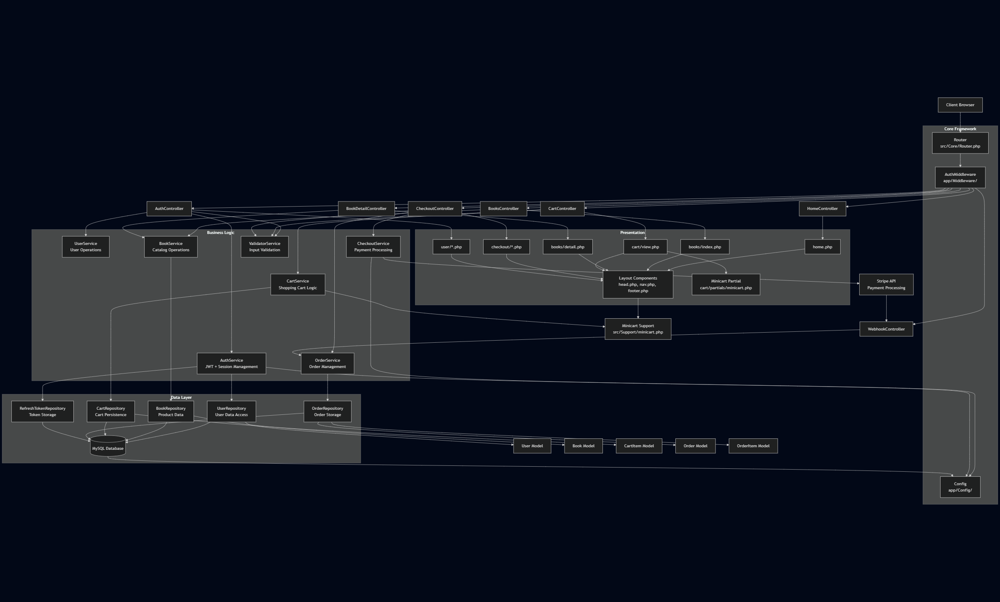

Bookstore — Server-Rendered PHP E-Commerce Sample
A minimal, extendable bookstore application built with plain PHP featuring a clean architecture pattern with controllers, services, repositories, and models.
Table of Contents

Project Overview
Architecture
Project Structure
Core Components
Authentication Flow
Cart & Checkout System
Testing
Database Migrations
Project Flow

Project Overview
This bookstore application demonstrates modern PHP development practices with:

Clean Architecture: Controllers delegate to services, services contain business logic, repositories handle data access
Dependency Injection: Lightweight DI container for service management
Server-Side Rendering: PHP templates with reusable components
Stripe Integration: Complete checkout flow with webhook handling
Secure Authentication: Session-based auth with JWT access tokens and refresh token rotation
Persistent Shopping Cart: Session fallback with database persistence for authenticated users
Comprehensive Testing: PHPUnit test coverage for critical flows

Architecture

Controllers: Thin layer handling HTTP requests and responses
Services: Business logic and workflow orchestration
Repositories: Database abstraction layer using PDO
Models: Data objects with convenience methods
Middleware: Request processing pipeline (authentication, etc.)

Core Components

Configuration

env.php: Environment variable loading
services.php: Dependency injection container configuration
settings.php: Application-wide settings

Framework Core (src/Core)

Container.php: Lightweight dependency injection container
Router.php: URL routing and request dispatching
Request.php: HTTP request abstraction
Response.php: HTTP response handling
Controller.php: Base controller with common functionality
View.php: Template rendering engine

Models & Data Layer

User.php: User entity with authentication properties
Book.php: Product catalog entity
CartItem.php: Shopping cart line items
Order.php: Purchase order entity
OrderItem.php: Order line items

Repository Pattern

Interfaces: Contract definitions for repositories
Concrete Repositories: Database access layer using PDO and Model objects
Data Persistence: MySQL/MariaDB with Phinx migrations

Model Objects Usage
The application uses model objects to represent data entities throughout the system:

Repositories use model objects to:

Retrieve data from the database and return as model instances

Persist model objects to the database

Convert between database rows and model instances

Services use model objects to:

Implement business logic operations on data entities

Pass data between different layers of the application

Validate and manipulate entity data

Authentication Flow
The application uses a dual-token authentication system:

Login Process:

User credentials validated via AuthService
JWT access token generated for server-side operations
Refresh token created (stored hashed in database)
Refresh token set as HttpOnly cookie
Session established with user context

Token Management:

Access tokens for API authentication
Refresh tokens for session continuity
Automatic token rotation on refresh
Secure logout with token cleanup

Middleware Protection:

AuthMiddleware guards protected routes
Session validation and user context injection

Cart & Checkout System
Cart Architecture

Dual Backend Support: Session-based fallback + persistent database storage
Auto-Detection: Switches between storage methods based on user authentication
Minicart Integration: Real-time cart updates in navigation

Checkout Flow

Cart Review: Summary display with item validation
Stripe Session Creation: Server-side session generation with line items
Payment Processing: Redirect to Stripe Checkout
Webhook Handling: checkout.session.completed event processing
Order Persistence: Final order creation and inventory updates

Webhook Security

Payload verification using Stripe webhook secrets
Event type validation before processing
Idempotent order creation to prevent duplicates

Testing
Comprehensive test coverage using PHPUnit:
bashvendor/bin/phpunit
Test Categories

AuthFlowTest.php: Authentication and authorization flows
BooksTest.php: Product catalog operations
CheckoutFlowTest.php: End-to-end purchase workflows

Tests validate both HTTP endpoints and direct service method calls.
Database Migrations
Database schema management via Phinx:

Migration Files: Timestamped schema changes in database/migrations/
Seeding: Sample data population via database/seeds/
Version Control: Track schema evolution and rollback capabilities

i think i covered it all, thank you for taking the time reading this!
